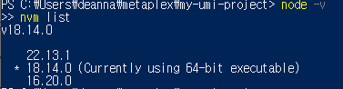
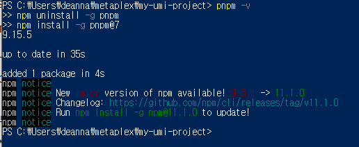
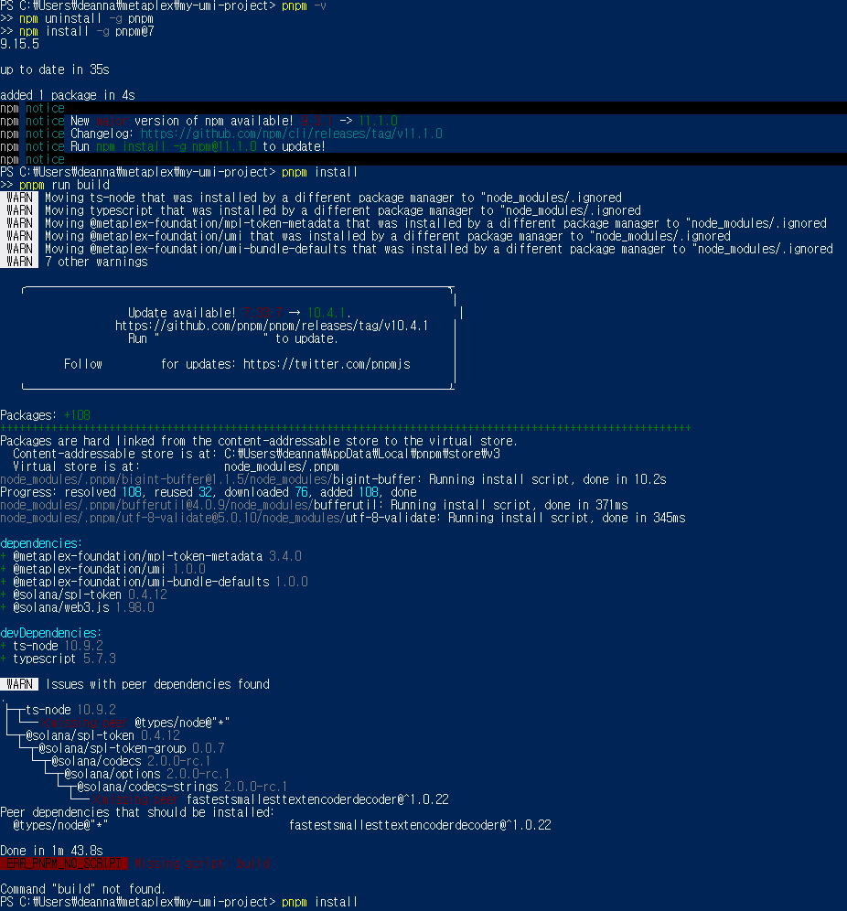
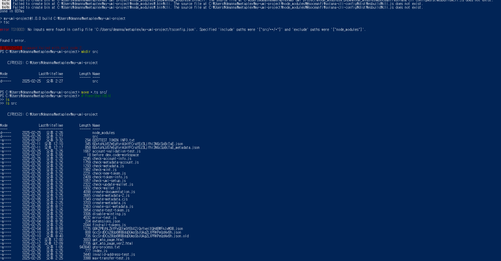
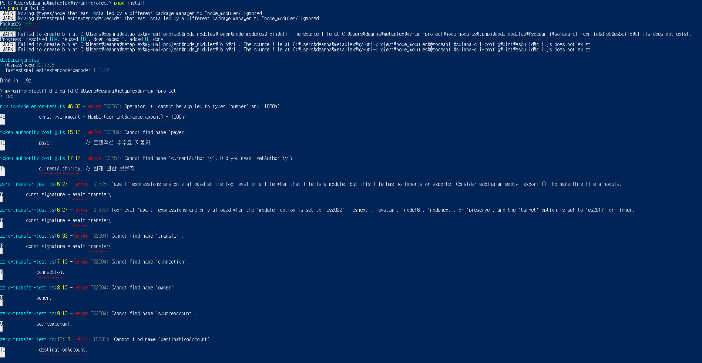
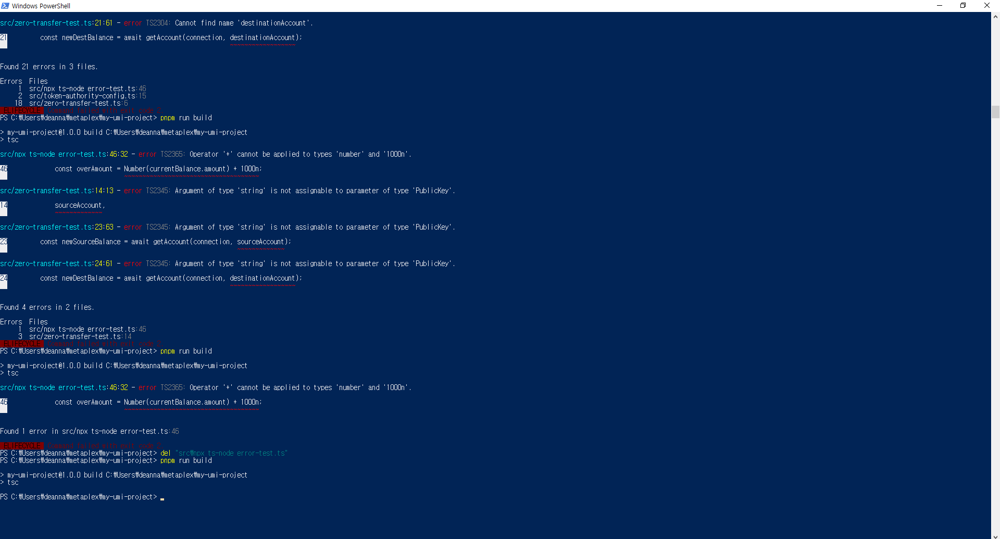

# Token Creation Guide

This guide walks you through creating a Solana SPL token using the required development environment and Solana CLI tools.

## Prerequisites

Before starting, ensure you have:
- Node.js (LTS version 16 or 18)
- PNPM or NPM
- Solana CLI tools
- Basic understanding of Solana wallets and keypairs


*Verify your Node.js version is compatible*

## Environment Setup

### 1. Verify Node.js and Package Manager

```bash
# Check Node.js version
node -v

# Verify PNPM installation
pnpm -v
```


*Ensure your package manager is properly configured*

### 2. Install Dependencies

If you encounter any installation issues:

```bash
# Install specific PNPM version if needed
npm uninstall -g pnpm
npm install -g pnpm@7
```


*Troubleshooting package manager installation*

### 3. Project Structure Setup

Organize your files properly:
```
my-token-project/
├── src/
│   └── create-token.ts
├── dist/
├── package.json
└── tsconfig.json
```


*Proper project structure organization*

## Token Creation Process

### 1. Build Configuration

Ensure your build configuration is correct:

```bash
pnpm install
pnpm run build
```


*Handle any build configuration issues*

### 2. Create SPL Token

```bash
# Create new token
spl-token create-token

# Create token account
spl-token create-account <TOKEN_MINT_ADDRESS>

# Mint initial supply
spl-token mint <TOKEN_MINT_ADDRESS> <AMOUNT>
```


*Successful token creation process*

## Step-by-Step Guide

### 1. Generate Keypair
```bash
solana-keygen new --outfile ~/.config/solana/id.json
```

### 2. Create Token
```bash
spl-token create-token
# Output: Creating token...
# Token: <YOUR_TOKEN_MINT_ADDRESS>
```

### 3. Create Token Account
```bash
spl-token create-account <YOUR_TOKEN_MINT_ADDRESS>
# Output: Creating account...
# Account: <YOUR_TOKEN_ACCOUNT>
```

### 4. Mint Tokens
```bash
spl-token mint <YOUR_TOKEN_MINT_ADDRESS> 1000
# Output: Minting 1000 tokens
```

### 5. Verify Balance
```bash
spl-token balance <YOUR_TOKEN_MINT_ADDRESS>
spl-token accounts
```

## Troubleshooting

### Common Issues

1. **Node Version Conflicts**
   - Use nvm to switch Node versions
   - Ensure PNPM compatibility

2. **Build Errors**
   - Check TypeScript configuration
   - Verify dependencies
   - Confirm file paths

3. **Solana CLI Issues**
   - Verify network connection
   - Check wallet balance
   - Confirm RPC endpoint

## Best Practices

1. **Environment Management**
   - Use LTS Node versions
   - Match PNPM version with Node
   - Keep CLI tools updated

2. **Security**
   - Backup keypairs
   - Use separate development wallets
   - Test on devnet first

3. **Development Flow**
   - Document mint addresses
   - Track token accounts
   - Monitor transactions

## Next Steps

1. [Set up token metadata](./metadata-setup.md)
2. Configure token properties
3. Deploy to mainnet
4. Add to liquidity pools

## Resources

- [Solana CLI Tools](https://docs.solana.com/cli)
- [SPL Token Program](https://spl.solana.com/token)
- [Metaplex Documentation](https://docs.metaplex.com/)

---

> **Note:** For detailed troubleshooting, refer to our [debugging notes](../journey/debugging-notes.md) and [lessons learned](../journey/lessons-learned.md).
