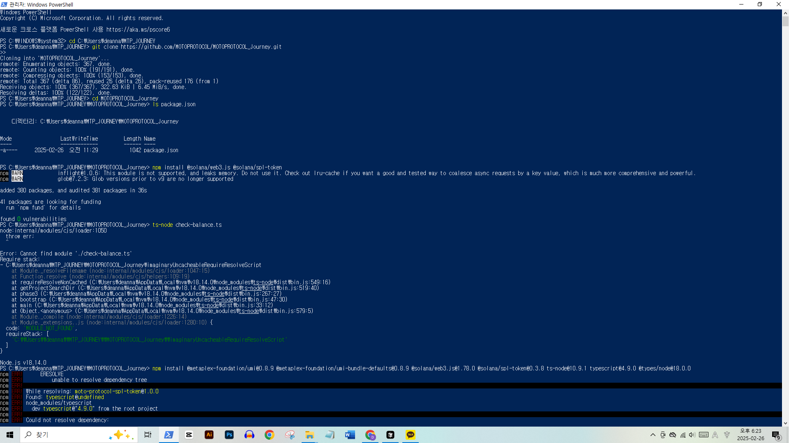
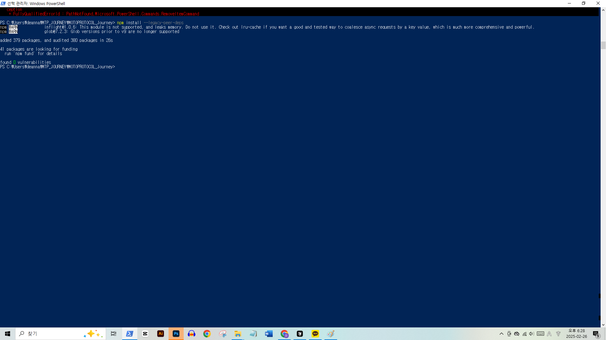

# Troubleshooting Guide

This guide covers common issues encountered during the MOTO PROTOCOL SPL Token Project setup and development process, along with their solutions.

## Environment Setup Issues

### Node.js Version Conflicts



#### Problem
- Incompatible Node.js version
- PNPM version conflicts
- Build failures due to version mismatch

#### Solution
```bash
# Check current version
node -v

# Install and use correct version
nvm install 16.20.0
nvm use 16.20.0
# or
nvm install 18.14.0
nvm use 18.14.0
```

### Project Structure Issues


#### Problem
- Incorrect file organization
- Missing directories
- TypeScript compilation errors

#### Solution
```bash
# Create proper directory structure
mkdir src dist
mv *.ts src/
```

## Build Process Issues

### Build Errors


#### Problem
- TypeScript configuration issues
- Dependency conflicts
- Compilation failures

#### Solution
1. Verify tsconfig.json:
```json
{
  "compilerOptions": {
    "target": "es2020",
    "module": "commonjs",
    "outDir": "./dist"
  }
}
```

2. Check dependencies:
```bash
pnpm install
pnpm run build
```

### Successful Build



## Common Issues & Solutions

### 1. PNPM Installation Issues

#### Problem
```bash
Error: This version of pnpm requires at least Node.js v18.12
```

#### Solution
```bash
# Option 1: Upgrade Node.js
nvm install 18.14.0
nvm use 18.14.0

# Option 2: Install compatible PNPM
npm uninstall -g pnpm
npm install -g pnpm@7
```

### 2. TypeScript Compilation Errors

#### Problem
```bash
Error: Cannot find module
Error: No inputs were found in config file
```

#### Solution
- Verify file paths in tsconfig.json
- Check import statements
- Ensure proper directory structure

### 3. Solana CLI Issues

#### Problem
- Network connection errors
- Insufficient balance
- Transaction failures

#### Solution
```bash
# Check Solana configuration
solana config get

# Verify balance
solana balance

# Airdrop on devnet (if needed)
solana airdrop 2
```

## Best Practices

### 1. Environment Verification
- Always check Node.js version
- Verify PNPM compatibility
- Test on devnet first

### 2. Project Setup
- Follow recommended structure
- Use version control
- Document configuration

### 3. Error Handling
- Log all errors
- Document solutions
- Share findings

## Quick Reference

### Environment Checks
```bash
# Node version
node -v

# PNPM version
pnpm -v

# Solana CLI version
solana --version
```

### Build Process
```bash
# Clean install
rm -rf node_modules
pnpm install

# Build project
pnpm run build
```

### Common Commands
```bash
# Create token
spl-token create-token

# Check balance
spl-token balance <TOKEN_ADDRESS>

# View accounts
spl-token accounts
```

## Additional Resources

- [Environment Setup Guide](../journey/environment-setup.md)
- [Debugging Notes](../journey/debugging-notes.md)
- [Lessons Learned](../journey/lessons-learned.md)

## Getting Help

If you encounter issues not covered in this guide:

1. Check the [GitHub Issues](https://github.com/your-org/moto-protocol/issues)
2. Review the [Debugging Notes](../journey/debugging-notes.md)
3. Submit a detailed bug report using our [template](../../.github/ISSUE_TEMPLATE/bug_report.md)

---

> **Note:** This guide is regularly updated based on user feedback and new issues encountered. Last updated: [Current Date]
