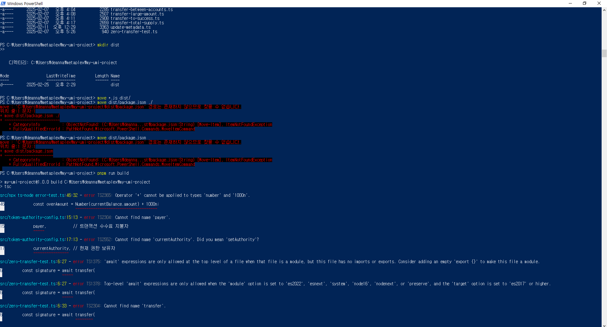

# Debugging Notes

This document details the debugging journey and solutions encountered while setting up the **MOTO PROTOCOL SPL Token Project**. It serves as both a personal record and a guide for others who might face similar issues.

## 1. Node Version Conflicts

### Issue
Initial build attempts failed due to Node.js version incompatibility.


### Solution
- Switched from Node.js 22.13.1 to v16.20.0 using nvm
- Ensured compatibility with Metaplex CLI requirements

### Key Learnings
- Always check project's recommended Node.js version
- Use nvm for easy version switching
- Document version-specific dependencies

## 2. Package Manager Issues

### Issue
PNPM installation and version conflicts caused build failures.


### Solution
- Uninstalled global PNPM
- Installed specific PNPM version (7.x)
- Verified compatibility with Node.js version

### Key Learnings
- Match PNPM version with Node.js version
- Use version-specific installations
- Document dependency relationships

## 3. PNPM Installation Errors

### Issue
Encountered workspace protocol and dependency resolution errors.


### Solution
- Resolved workspace protocol issues
- Fixed dependency conflicts
- Updated PNPM configuration

### Key Learnings
- Understand workspace protocols
- Check for dependency conflicts
- Maintain clear configuration

## 4. Build Process Errors

### Issue
Build process failed with various configuration errors.


### Solution
- Corrected TypeScript configuration
- Updated build scripts
- Fixed path references

## 5. File Structure Issues

### Issue
TypeScript compilation failed due to incorrect file organization.


### Solution
- Created proper directory structure (src/, dist/)
- Updated tsconfig.json paths
- Reorganized TypeScript files

## 6. Distribution Folder Issues

### Issue
Build process couldn't locate or generate distribution files correctly.



### Solution
- Corrected output directory configuration
- Fixed file path references
- Updated build scripts

## 7. Final Resolution

### Success
After addressing all issues, achieved successful build.


### Key Learnings
- Systematic debugging approach works best
- Document all steps and solutions
- Test each fix independently

## Common Issues & Solutions

### 1. PNPM Workspace Issues
```bash
Error: Unsupported URL Type 'workspace:*'
```
**Solution:** Use PNPM 7.x with Node.js 16, or latest PNPM with Node.js 18+

### 2. TypeScript Configuration
```bash
Error: No inputs were found in config file
```
**Solution:** Verify tsconfig.json paths and file structure

### 3. Build Process
```bash
Error: Cannot find module
```
**Solution:** Check node_modules, rebuild dependencies

## Debugging Checklist

1. **Environment Check**
   - [ ] Node.js version compatible
   - [ ] PNPM version aligned
   - [ ] Required global packages installed

2. **Project Structure**
   - [ ] Correct directory hierarchy
   - [ ] Source files in proper location
   - [ ] Configuration files updated

3. **Build Process**
   - [ ] Dependencies installed
   - [ ] TypeScript configuration valid
   - [ ] Build scripts properly defined

## Best Practices Learned

1. **Version Management**
   - Use nvm for Node.js version control
   - Document specific version requirements
   - Keep package.json updated

2. **Project Organization**
   - Maintain clear directory structure
   - Separate source and compiled code
   - Use consistent naming conventions

3. **Debugging Approach**
   - Start with environment verification
   - Check configuration files
   - Test incrementally
   - Document solutions

## Resources

- [TypeScript Configuration Guide](https://www.typescriptlang.org/docs/handbook/tsconfig-json.html)
- [PNPM Workspace Guide](https://pnpm.io/workspaces)
- [Node.js Version Management](https://github.com/nvm-sh/nvm)

## Next Steps

1. Implement automated environment checks
2. Create setup verification scripts
3. Enhance error handling
4. Update documentation with new findings

---

> **Note:** This document is continuously updated as new issues and solutions are discovered. Last updated: 2.25.2025
